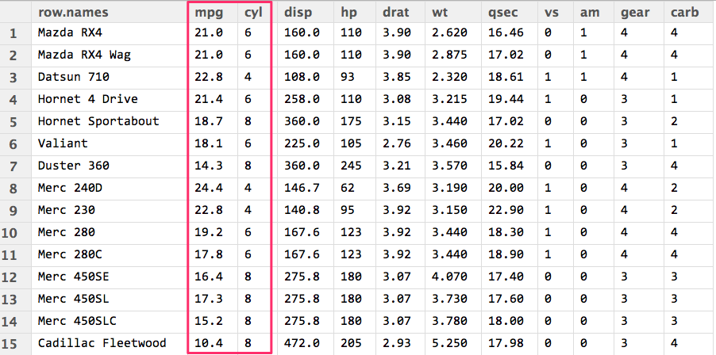

<link rel='stylesheet' href='./assets/main.css'/>

[<< back to main index](./README.md) 

# KMeans Lab

In this lab we discuss how to use kmeans clustering in Spark.

Step 1: Examine the MTCars dataset
---------------

Check out the dataset that we are going to cluster: MTCars. Those of you
with experience in R should remember this as one of R's internal datasets.

This dataset contains some statistics on 1974 Cars from Motor Trends



You can also download and view the raw data in Excel : [cars.csv](../../data/mtcars/mtcars.csv)

Here are the columns:
* name   - name of the car
*  mpg   - Miles/(US) gallon                        
*  cyl   - Number of cylinders                      
*  disp  - Displacement (cu.in.)                    
*  hp    - Gross horsepower                         
*  drat  - Rear axle ratio            
*  mpg   - Miles/(US) gallon                        
*  cyl   - Number of cylinders                      
*  disp  - Displacement (cu.in.)                    
*  hp    - Gross horsepower                         
*  drat  - Rear axle ratio            

Are there any natural clusters you can identify from this data?

We are going to use **MPG and CYL** attributes to cluster.


Step 2: Inspect the script
--------------
Open file `kmeans_mtcars.scala` and examine it.  
This is a fully functional K-means script.  
We are going to run this **line-by-line** in Spark Shell to understand what is going on.

Step 3 : Launch Spark Shell
-----------
```
    # go to the kmeans dir
    $  cd   ~/spark-labs/06-mllib/kmeans

    # start shell
    $  ~/spark/bin/spark-shell
```

**=> Open the script `kmeans_mtcaras.scala` in a favorite editor.**  

**=> Copy paste snippets from text editor into Spark shell.  Watch the execution and the results**  
Hint : When copying functions like `parseData` copy the entire function {} instead of line by line.

**=> Also keep an eye on Spark web UI (4040) **


Step 4 : ParseData
----------
In this function, we're going to go from the RDD input file
to an output as a tuple of Vector Names and Vectors.  Vector 
names are derived from the first (0th) column, whereas the
numerical data comprises the rest, which is converted into
a vector.dense

```scala

    def parseData(vals : RDD[String]) : RDD[(String, Vector)] = {
      vals.map { s =>
        val splitData = s.split(',')
        val name = splitData(0)
        val mpg = splitData(1)
        val cyl = splitData(2)
        // let's just consider mpg and cylinders for clustering
        val doubles = Array(mpg,cyl).map(_.toDouble)
        val vectors = Vectors.dense(doubles)
        (name, vectors) // (key , value) RDD
      }
    }
```


Note: In scala we could re-write this whole function as the following one-liner:

    onlyVectors = data.map(s => Vectors.dense(s.split(',').drop(1).map(_.toDouble)))


Step 5: Make an RDD of ONLY the vectors (not the names)
------------------
Now that we have the names and vectors, we can go back and get only the vectors, as kmeans only works on an RDD of vectors (no names attached).

```scala
    val data = sc.textFile("../../data/mtcars/mtcars.csv")
    val namesAndData = parseData(data)
    val onlyVectors = namesAndData.map { case (name, vector) => vector } 
```


Step 6: Run KMeans
-----------------
The following code runs KMeans

```scala
    val clusters = KMeans.train(onlyVectors, 2, 10)
```

* first argument : the vectors RDD
* second argument (2) : how many clusters (this is the K in KMeans)
* number of iterations (10)


Step 7 : Printing out the clusters
----------------------
The following code prints out the clusters in a user-friendly way
```scala
    val carsByCluster =namesAndData.map(s => (clusters.predict(s._2), (s._1,s._2))).sortByKey().collect()

    carsByCluster.foreach { println }
```

The output may look like the following.  
Here we see **two clusters** (cluster 0 and cluster 1).  
**Compare the cars in each cluster,  Pay special attention to MPG (first attribute in vector) and CYLINDERS (second attribute).**

```console
    (0,("Mazda RX4",[21.0,6.0]))
    (0,("Mazda RX4 Wag",[21.0,6.0]))
    (0,("Datsun 710",[22.8,4.0]))
    (0,("Hornet 4 Drive",[21.4,6.0]))
    (0,("Merc 240D",[24.4,4.0]))
    (0,("Merc 230",[22.8,4.0]))
    (0,("Fiat 128",[32.4,4.0]))
    (0,("Honda Civic",[30.4,4.0]))
    (0,("Toyota Corolla",[33.9,4.0]))
    (0,("Toyota Corona",[21.5,4.0]))
    (0,("Fiat X1-9",[27.3,4.0]))
    (0,("Porsche 914-2",[26.0,4.0]))
    (0,("Lotus Europa",[30.4,4.0]))
    (0,("Volvo 142E",[21.4,4.0]))
    (1,("Hornet Sportabout",[18.7,8.0]))
    (1,("Valiant",[18.1,6.0]))
    (1,("Duster 360",[14.3,8.0]))
    (1,("Merc 280",[19.2,6.0]))
    (1,("Merc 280C",[17.8,6.0]))
    (1,("Merc 450SE",[16.4,8.0]))
    (1,("Merc 450SL",[17.3,8.0]))
    (1,("Merc 450SLC",[15.2,8.0]))
    (1,("Cadillac Fleetwood",[10.4,8.0]))
    (1,("Lincoln Continental",[10.4,8.0]))
    (1,("Chrysler Imperial",[14.7,8.0]))
    (1,("Dodge Challenger",[15.5,8.0]))
    (1,("AMC Javelin",[15.2,8.0]))
    (1,("Camaro Z28",[13.3,8.0]))
    (1,("Pontiac Firebird",[19.2,8.0]))
    (1,("Ford Pantera L",[15.8,8.0]))
    (1,("Ferrari Dino",[19.7,6.0]))
    (1,("Maserati Bora",[15.0,8.0])) 
```


**=> Does the clustering make sense?  Perhaps we have too few clusters?** 


Step 8 : Run the whole script
------------
**=> Exit spark shell, by pressing Ctrl+D**

**=> Run the spark shell in terminal as follows**

```
    $ ~/spark/bin/spark-shell -i kmeans_mtcars.scala
```

This will run the entire script in one go!


Step 9 : Adjust the cluster number (K)
------
Edit file `kmeans_mtcars.scala`.   
**=> Change the `number of clusters` argument supplied to `Kmeans.train()` from `2` to `3`  function (around line # 60).**  

Run the script again
```
    $ ~/spark/bin/spark-shell -i kmeans_mtcars.scala
```

Inspect the output.   
Does clustering of cars make sense?
Try different values of `K` (4 or 5).

Make a note of the "wall clock time. " We will optimize this later.

Step 10: Optimize Script
----------

Even though the dataset is tiny, notice that the datasets are running on disk without caching.  Could the cache() method help us at all?  

Edit file `kmeans_mtcars.scala`.  
Cache RDD `onlyVectors` , around line number 50, as follows
```scala
    onlyVectors.cache
    onlyVectors.count  // force caching
```

Then run again and note the wall clock time.
```
    $ time  ~/spark/bin/spark-shell -i kmeans_mtcars.scala
```


Step 11: Record and Plot WSSSE versus K
-----------
Perform a plot of WSSSE versus K.  
Use the provided [excel sheet](WSSSE-versus-k.xlsx).   
Use the "elbow" method to pick what seems to be a good value of k.  
Does that match your intuitive sense of what is the best?

The excel sheet also have a sample plot we did.  
And here is the 'elbow curve'.   


Step 12: Add some new data, check and see if it changes the clusters.
-------
Edit input data file `../../../data/mtcars/mtcars.csv`.  
Add some new rows to the mtcars dataset based on your favorite cars (or just
make up some fictitious cars).

Then run the script again.
```
    $ time  ~/spark/bin/spark-shell -i kmeans_mtcars.scala  2> logs
```

See how adding this affects the way the data is clustered?


BONUS: Automatically iterate across k.
------------
Is there a way you could modify this to loop through values of K instead of 
manually changing the values?  

BONUS 2: Programmatically Perform Elbow Method
--------

Using the principles of the "elbow" method, what is a way you could automatically
select a k value?
